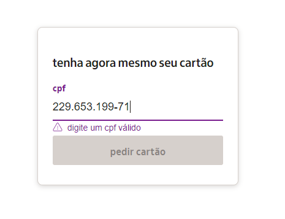
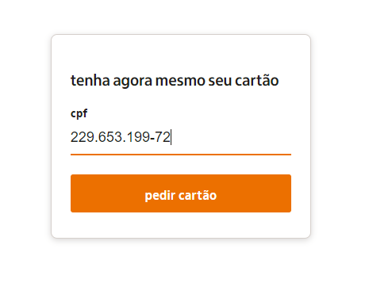

<br />

<h1 align="center">Validar CPF</h1>
<h3 align="center">🔍 Teste se um dado CPF seria válido pela <a href='https://g.co/kgs/JLng1a'>Receita Federal</a></h3>

<br>

<p align="center">Disponível em:</p>
<p align="center">
  <a href="https://github.com/wolney-fo/banco-de-metodos/blob/main/validarCPF/testarCPF.py" target="_blank">
    
  </a>
  <a href="https://github.com/wolney-fo/banco-de-metodos/blob/main/validarCPF/testarCPF.java" target="_blank">
    
  </a>
  <a href="[#](http://www.receita.fazenda.gov.br/aplicacoes/atcta/cpf/funcoes.js)" target="_blank">
    
  </a>
</p>

<br />

<p align="center">
  <a href="https://codesandbox.io/embed/github/pmndrs/lamina/tree/main/examples/complex-materials" target="_blank"></a>
  <a href="https://codesandbox.io/embed/github/pmndrs/lamina/tree/main/examples/layer-materials" target="_blank"></a>
</p>
<p align="middle">
  <i>A demonstração acima foi retirada do site do Banco Itaú para exemplificar o método. Entretanto, a plataforma não o utiliza.</i>
</p>

<br />

## 💻 O método

A função retorna o tipo `boolean` respondendo sobre a validade do CPF informado como argumento. Veja exemplos de aplicações em diferentes linguagens 👇👇

Python 🐍
``` python
if not testeCPF(cpf):
    print('CPF inválido')
else:
    print('CPF válido')
```
Java ☕
``` java
if (CpfFunctions.testaCPF(cpf)){
    System.out.println("CPF válido");
}
else {
    System.out.println("CPF inválido");
}
```

<br>

> 💡Em seu funcionamento, utiliza o outro método `retiraCaracteresInvalidos()` para tratar o dado inserido. A função está presente no mesmo arquivo.

<br>

## 🧮 A fórmula

O cálculo para validar um CPF é especificado pelo Ministério da Fazenda. O documento é formado por 11 dígitos numéricos que seguem o padrão `###.###.###-##`, sua verificação é feita realizando um cálculo com os 9 primeiros que determinam os 2 restantes.

### `Dígito 1`

> 💡Utilizando `529.982.247-25` como um CPF fictício para testes.

Primeiro, multiplicamos os 9 primeiros dígitos pela sequência decrescente de números de 10 à 2 e somamos os resultados. E, então, multiplicamos por 10: 

```
(5 * 10 + 2 * 9 + 9 * 8 + 9 * 7 + 8 * 6 + 2 * 5 + 2 * 4 + 4 * 3 + 7 * 2) = 295

295 * 10 = 2950
```

O número do primeiro dígito verificador é o resto da divisão do resultado por 11:

```
2950 / 11 = 268
Resto = 2
```

### `Dígito 2`

Parecida com a validação do primeiro, porém vamos considerar os 9 primeiros dígitos e o primeiro dígito verificador e multiplicamos esses 10 números pela sequencia decrescente de 11 a 2:

```
(5 * 11 + 2 * 10 + 9 * 9 + 9 * 8 + 8 * 7 + 2 * 6 + 2 * 5 + 4 * 4 + 7 * 3 + 2 * 2) = 347

347 * 10 = 3470
```
O número do segundo dígito verificador também é o resto da divisão do resultado por 11:
```
3470 / 11 = 315
Resto = 5
```

Assim, o CPF utilizado seria válido, pois os dígitos verificadores foram confirmados

<br>

👉 Confira mais no portal [Dicas de Programação](https://dicasdeprogramacao.com.br/algoritmo-para-validar-cpf/). 👀

<br>

## Licença
MIT by Wolney Oliveira
